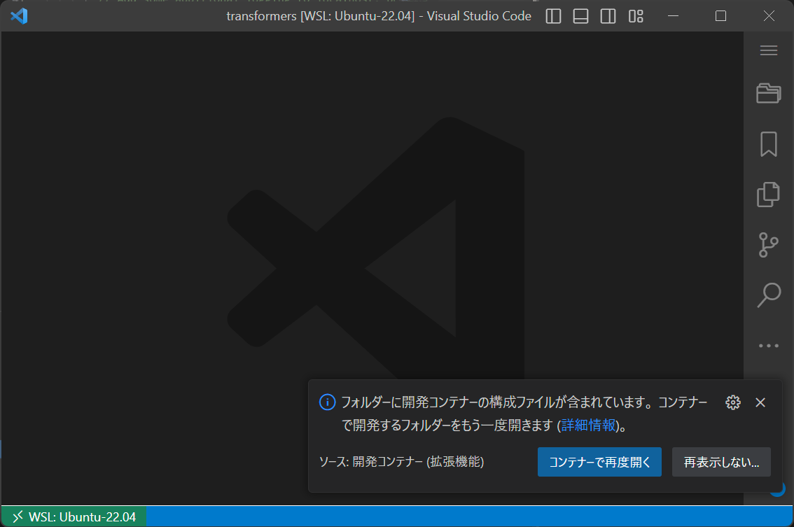
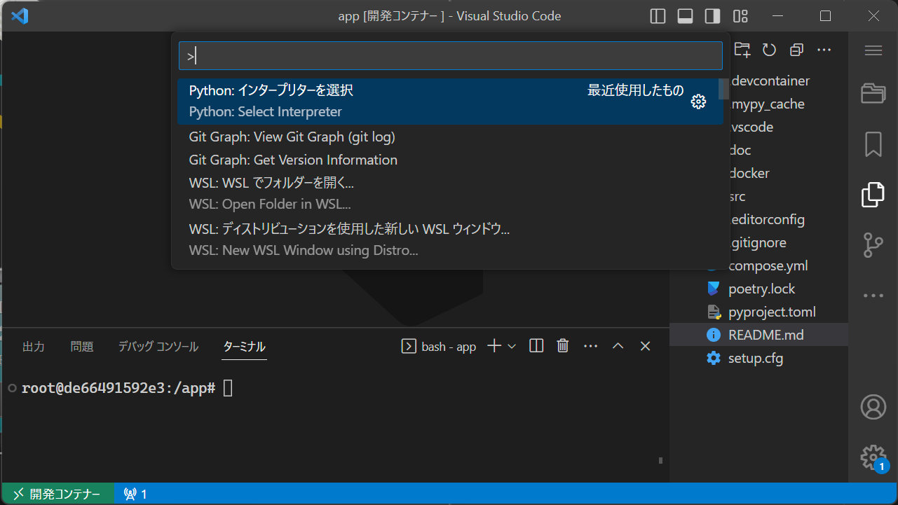
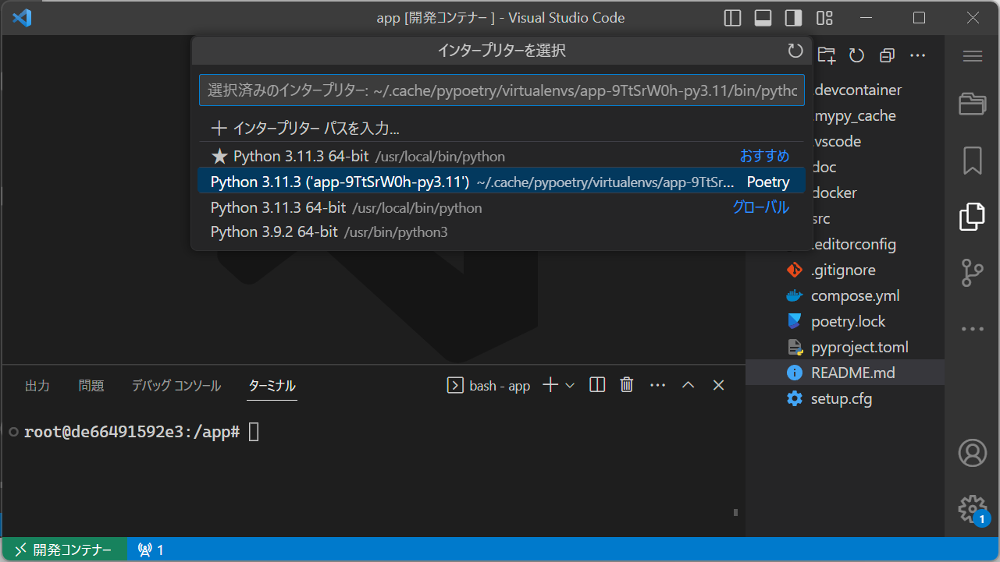

# 環境構築手順
## 必要条件

以下がインストール済みであること。

* [VSCode](https://code.visualstudio.com/)
* [Docker Engine](https://docs.docker.com/engine/)および[Docker Compose](https://docs.docker.com/compose/)(Linuxの場合)、あるいは[Docker Desktop](https://www.docker.com/products/docker-desktop/)(Windowsの場合)
* [git](https://git-scm.com)(Linuxの場合)、あるいは[Git for Windows](https://gitforwindows.org)(Windowsの場合)

## 初回環境構築
### 構築手順

1. VSCodeを起動する。
2. VSCodeに以下の拡張機能を追加する。
    * [Dev Containers](https://marketplace.visualstudio.com/items?itemName=ms-vscode-remote.remote-containers) 
        * 拡張機能ID `ms-vscode-remote.remote-containers`
    * [Japanese Language Pack for Visual Studio Code](https://marketplace.visualstudio.com/items?itemName=MS-CEINTL.vscode-language-pack-ja)
        * 拡張機能ID: `MS-CEINTL.vscode-language-pack-ja`
        * この拡張機能の追加は任意だが、この手順書では導入した場合の画面例を用いる。
3. 本リポジトリをローカルにクローンする。
4. クローンしたリポジトリをVSCodeで開く。
5. 以下のダイアログが表示されたら、`コンテナ―で再度開く`を選択する。
    * 
6. コンテナ内で以下を実行する。

    ```bash
    poetry install
    ```

7. 以下の手順でPythonインタープリターを選択する。
    * 
    * 

### 確認手順

1. `src/sample.py`を開く。
2. 以下を確認する。
    * リンタ(mypy, flake8)が有効になっている。
    * 保存時にフォーマッタ(black, isort)が実行される。

上記の確認手順でフォーマッタが実行されなかった場合、一度コンテナに再接続すると解消する場合がある。

## 初回以降の接続方法

初回環境構築時と同様に、ローカルリポジトリをVSCodeで開き、ダイアログが表示されたら、`コンテナ―で再度開く`を選択する。
